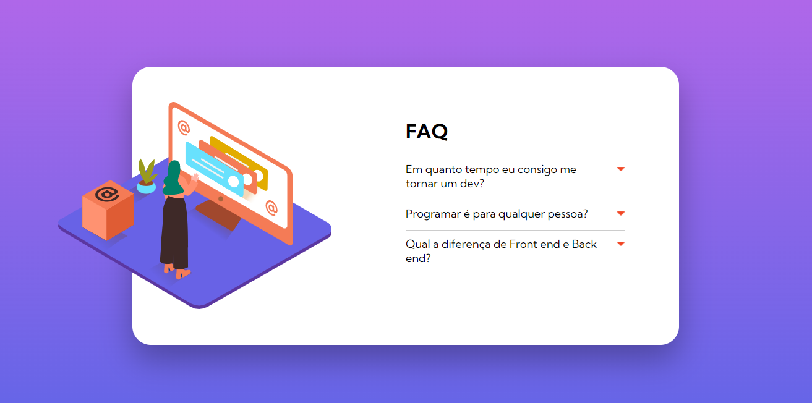
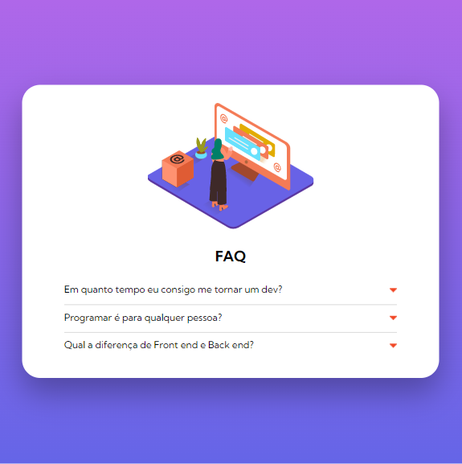
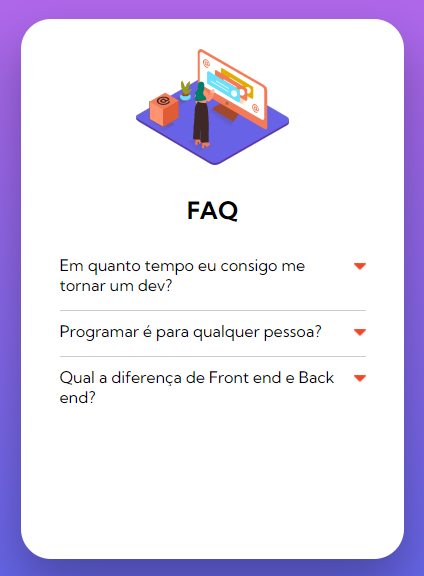

<h1  align="center">Aplicação FAQ Dev</h1>

  FAQ Dev é uma aplicação front-end desenvolvida em Html, CSS e Javascript para ajudar desenvolvedores iniciantes a tirar dúvidas de como ingressar nesse setor tão aquecido. A aplicação é totalmente responsiva.

<h2 id="demonstracao">Demonstração</h2>

  
  
  

<h2 id="autora">👤 Autor</h2>

<h3>Desenvolvido por Ricardo Nagel</h3>

* [Linkedin](https://www.linkedin.com/in/ricardonagel/)
* [Github](https://github.com/nagelricardo)

  
<strong align="center">Deixe sua ⭐️ se gostou do projeto</strong>

  
